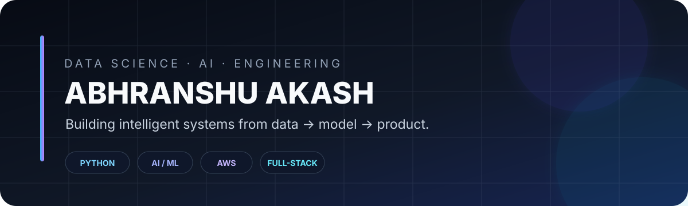

<!-- ===================== HERO ===================== -->

  <picture>
    <source media="(prefers-color-scheme: dark)" srcset="./dark.svg">
    <source media="(prefers-color-scheme: light)" srcset="./light.svg">
    
  </picture>

  <b>Data Science · AI/ML · Data Engineering · Full-Stack AI</b>

  🐍 Python &nbsp;·&nbsp; 📊 Data & ML &nbsp;·&nbsp; ⚡ FastAPI &nbsp;·&nbsp; ⚛️ React
  &nbsp;·&nbsp; ☁️ AWS &nbsp;·&nbsp; 🐳 Docker &nbsp;·&nbsp; 🗄️ SQL / NoSQL

  

---

## 👋 About Me

  I'm <b>Abhranshu Akash</b>, a Data Science student focused on building practical systems where
  <b>data, AI and software engineering</b> meet.

  I enjoy taking ideas from <b>dataset → model → API → product → deployment</b>.
  My current work spans machine learning, analytics, backend systems, cloud deployment and AI-powered applications.

---

## 🧠 What I Build

<table align="center">
<tr>
<td width="50%" valign="top">

### 📊 Data & AI
- Data analysis and visualization
- Machine learning pipelines
- NLP and AI applications
- Model evaluation and experimentation
- Intelligent automation

</td>
<td width="50%" valign="top">

### ⚙️ Engineering
- REST APIs and backend services
- Full-stack applications
- Database-driven systems
- AWS cloud deployments
- Dockerized production workflows

</td>
</tr>
</table>

---

## 🚀 Featured Projects

### 🔥 UseItUp — AI Food-Waste Assistant
An AI-powered application built during **Bharat Builds**, combining food inventory, expiry awareness, recipe generation and nutrition-oriented workflows.

**Stack:** AWS · Bedrock · Lambda · S3 · API Gateway · Docker · React

### 🛰️ ATLAS — Adaptive Trust & Drift Detection
An ML-driven IoT security project focused on telemetry analysis, anomaly detection and adaptive trust/drift monitoring.

**Stack:** Python · FastAPI · Scikit-learn · Isolation Forest · Random Forest · LSTM

### 🤝 NegotiateAI
An AI negotiation system exploring automated negotiation workflows, model integration and backend application design.

**Stack:** Python · FastAPI · AI/LLMs · APIs · Docker

### 📈 WasteLess AI
A data analytics project focused on understanding food waste through data processing, analysis and visualization.

---

## 🏆 Hackathons & Building

  <b>Hackathons are where I like to pressure-test ideas.</b>

  🚀 Rapid prototyping &nbsp;·&nbsp; 🤖 AI products &nbsp;·&nbsp; ☁️ Cloud deployment
  &nbsp;·&nbsp; 🧩 Real-world problem solving

  I have participated in multiple national-level hackathons, building projects across
  <b>AI, data, cloud, web applications and intelligent systems</b>.

---

## 🛠️ Engineering Stack

### Languages

### Data / AI

 
<code>Pandas</code> <code>NumPy</code> <code>Scikit-learn</code> <code>Matplotlib</code> <code>NLTK</code>

### Backend / Web

### Databases / Cloud / DevOps

---

## ☁️ From Model to Production

  <code>Data</code>
  → <code>EDA</code>
  → <code>ML / AI</code>
  → <code>FastAPI</code>
  → <code>Docker</code>
  → <code>AWS</code>
  → <code>Production</code>

  I am especially interested in the engineering layer around AI:
  <b>APIs, deployment, cloud infrastructure, data pipelines and scalable systems.</b>

---

## 📊 GitHub Activity

  

  

---

## 🐍 Contribution Activity

  <picture>
    <source media="(prefers-color-scheme: dark)" srcset="https://raw.githubusercontent.com/abhranshu/abhranshu/output/github-snake-dark.svg">
    <source media="(prefers-color-scheme: light)" srcset="https://raw.githubusercontent.com/abhranshu/abhranshu/output/github-snake.svg">
    
  </picture>

---

## 📫 Connect With Me

  
  

  <i>Build. Break. Learn. Ship.</i>

